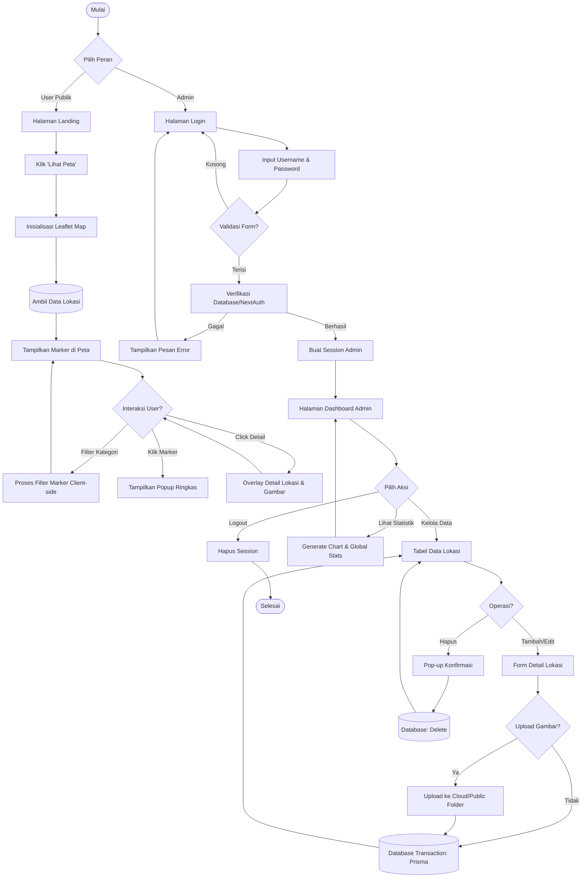
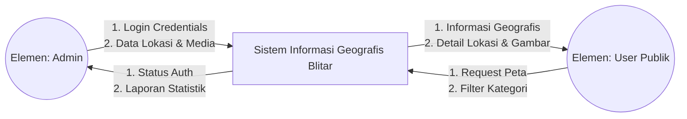
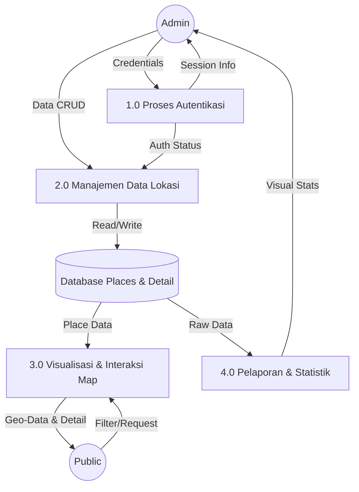
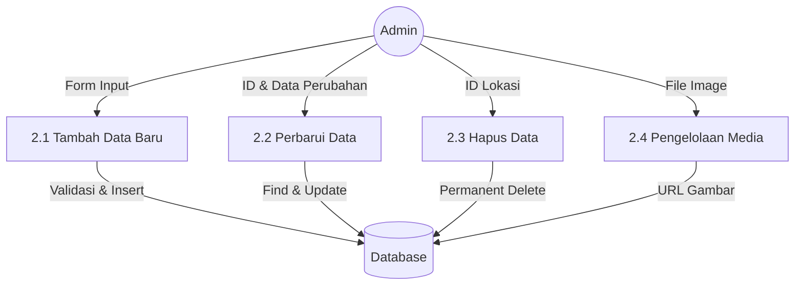
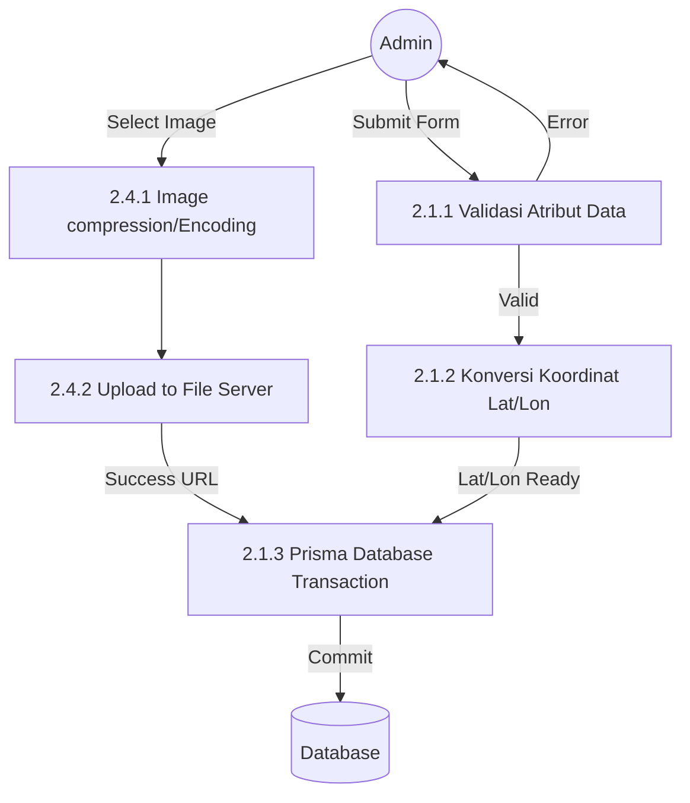
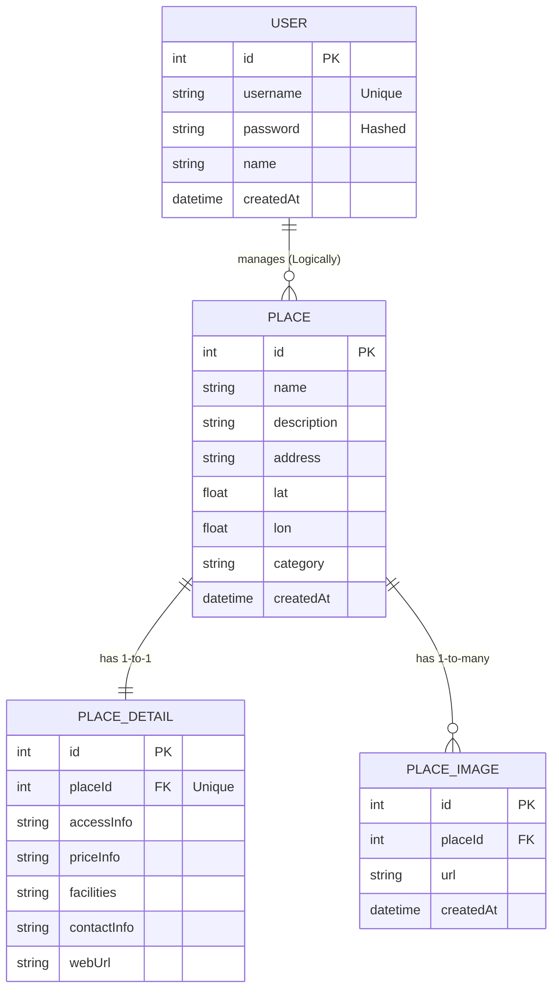

# Dokumentasi Sistem GIS-Blitar (Laporan Lengkap)

Dokumen ini berisi diagram teknis lengkap yang dirancang untuk keperluan laporan praktik/tugas akhir, mencakup DFD dari Level 0 hingga 3, ERD, dan Flowchart sistem yang rinci.

---

## 1. Flowchart Sistem (Detailed Logical Flow)

Flowchart ini membedah alur logika program secara mendalam, termasuk validasi input dan manajemen sesi.

---

## 2. Data Flow Diagram (DFD) - Level 0 sampai 3

### DFD Level 0 (Context Diagram)

Menggambarkan batas sistem dan interaksi dengan entitas eksternal.

### DFD Level 1 (Top Level Process)

Membagi sistem menjadi 4 proses utama.

### DFD Level 2 (Decomposition of 2.0 Maintenance Data)

Fokus pada alur input, edit, dan hapus data.

### DFD Level 3 (Decomposition of 2.1 & 2.4 - Detailed Transaction)

Level paling rinci mencakup validasi teknis.

---

## 3. Entity Relationship Diagram (ERD) - Relational Model

Struktur data yang digunakan dalam database PostgreSQL via Prisma.

> [!TIP]
> **Cara Menggunakan dalam Laporan:**
>
> 1. Salin kode `mermaid` di atas ke **[Mermaid Live Editor](https://mermaid.live/)**.
> 2. Unduh hasilnya dalam format **SVG** (untuk kualitas cetak terbaik) atau **PNG**.
> 3. Masukkan ke dalam bab dokumentasi sistem pada laporan Anda.
